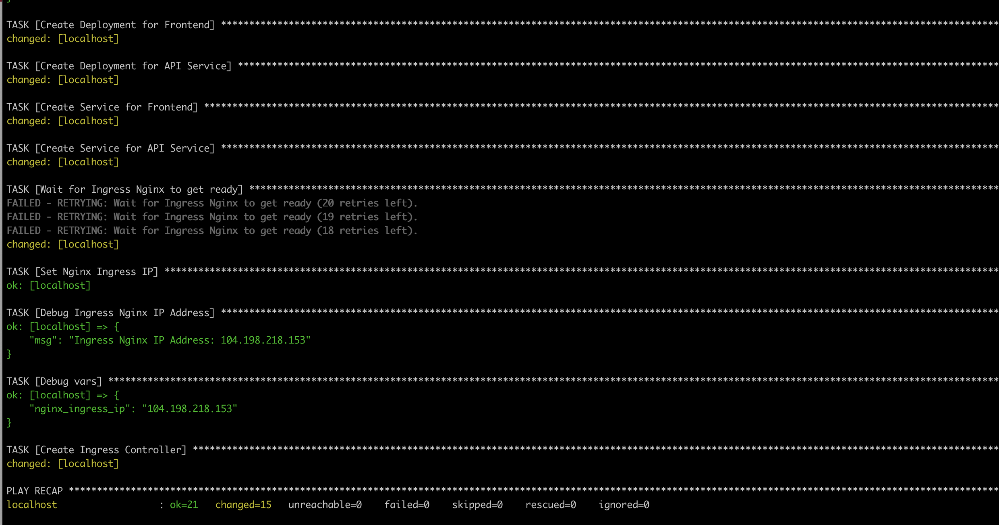
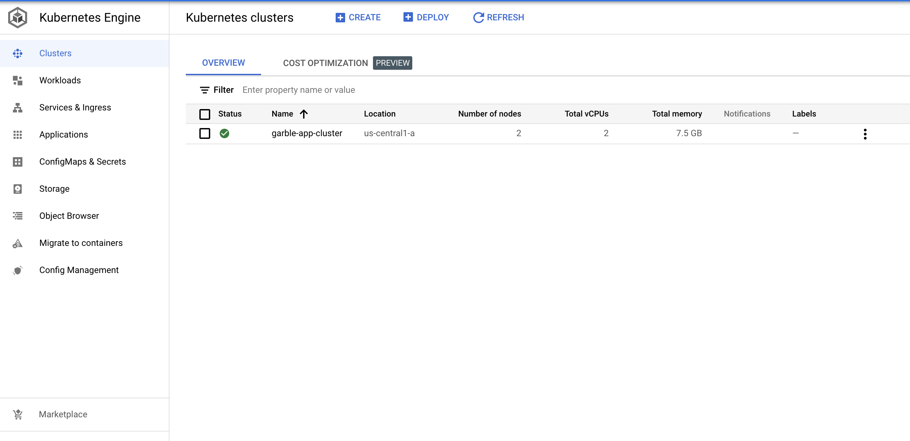
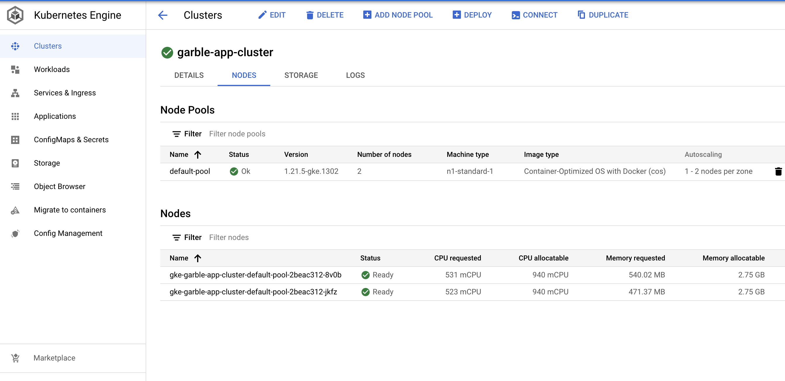
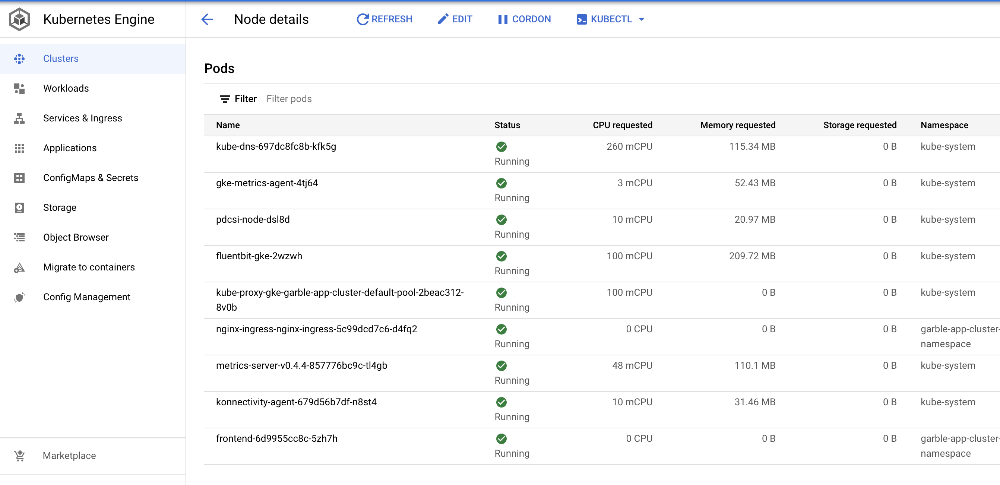
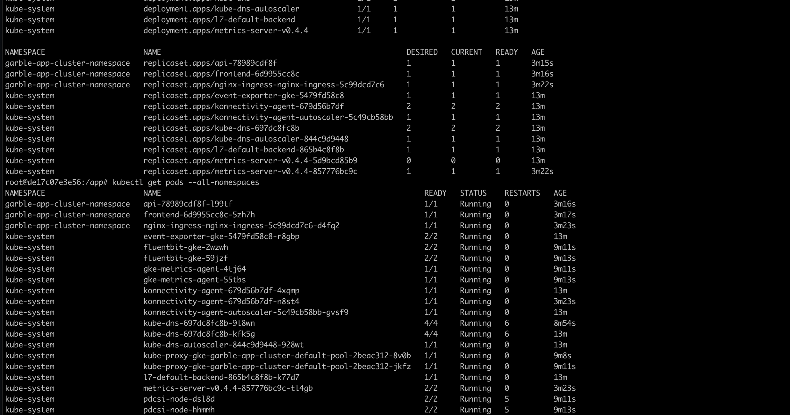
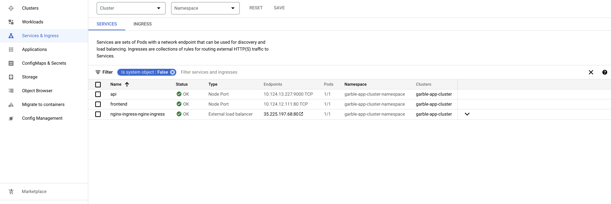
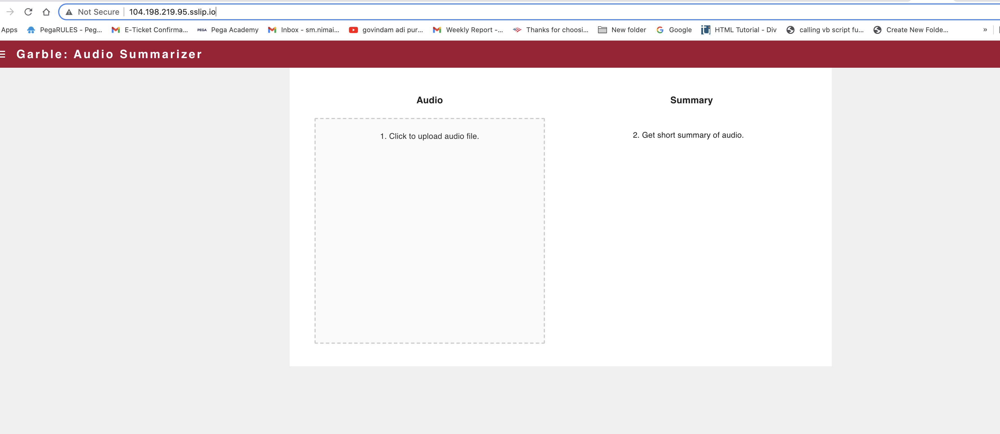

# Garble: Audio Summarizer- Setup & Code Organization

In this project  we will setup three containers:

* api-service
* frontend-react
* frontend-simple

The following container architecture is what we will implement:


## Prerequisites
* Have Docker installed
* Check that your Docker is running with the following command

`docker run hello-world`

### Install Docker 
Install `Docker Desktop`

#### Ensure Docker Memory
- To make sure we can run multiple container go to Docker>Preferences>Resources and in "Memory" make sure you have selected > 4GB

### Install VSCode  
Follow the [instructions](https://code.visualstudio.com/download) for your operating system.  
If you already have a preferred text editor, skip this step.  

### Make sure we do not have any running containers and clear up an unused images
* Run `docker container ls`
* Stop any container that is running
* Run `docker system prune`
* Run `docker image ls`

## Create project folders
- Create a root project folder `garble-app`
- Organize containers into sub folders, create the following folders inside the project folder:
    * `api-service`
    * `frontend-simple`
    * `frontend-react`

- Create a folder called `persistent-folder` inside the root project folder
- Create a folder called `secrets` inside the root project folder
- Add a `.gitignore` file at the root project folder. 

### **We do not want to push the content in `persistent-folder` and `secrets` to GitHUb**

`.gitignore`
```
/persistent-folder
/secrets
```

## Frontend App (Simple) Container
We will create a simple frontend app that uses basic HTML & Javascript. 

### Go into the frontend-simple folder 
- Open a terminal and go to the location where `garble-app/frontend-simple`

### Add a `Dockerfile`
Start with a base docker container with and add the following:
- Use a base image slim version fo Debian with node installed
- Ensure we have an up to date baseline, install dependencies
- Install `http-server`
- Create a user so we don't run the app as root, add a user called `app`
- Create a directory `app`, where we will place all our code
- Set the owner of the directory as the newly created user
- Expose port `8080` from the container to the outside for the web server
- Switch the user to `app` and set the the working directory to `app`
- Set the entrypoint of the container to `bash`

### Add a `docker-shell.sh` or `docker-shell.bat`
Based on your OS, create a startup script to make building & running the container easy

### Add a App home page

`index.html`
```
<!DOCTYPE html>
<html>
    <head>
        <title>Garble: Audio Summarizer/title>
    </head>
    <body>
         Welcome to the Audio Summarizer App!
    </body>
</html>
```

### Build & Run Container
- Run `sh docker-shell.sh` or `docker-shell.bat` for windows

### Start Web Server
- To run development web server run `http-server` from the docker shell
- Test the web app by going to `http://localhost:8080/`


## Backend API Container
We will create a basic backend container to run our REST API. The FastAPI framework will be used for this.

### Go into the api-service folder 
- Open a terminal and go to the location where `mushroom-app/api-service`

### Add a `Dockerfile`
Start with a base docker container with and add the following:
- Use a base image slim version fo Debian with python 3.8 installed
- Ensure we have an up to date baseline, install dependencies
- Upgrade `pip` & Install `pipenv`
- Create a user so we don't run the app as root, add a user called `app`
- Create a directory `app`, where we will place all our code
- Set the owner of the directory as the newly created user
- Expose port `9000` from the container to the outside for the api server
- Switch the user to `app` and set the the working directory to `app`
- Install python packages using the `Pipfile` & `Pipfile.lock`
- Execute  `pipenv sync` to ensure we have the updated python environment
- Set the entrypoint of the docker container to `bash` and call the script `docker-entrypoint.sh`


### Add a `docker-shell.sh` or `docker-shell.bat`
Based on your OS, create a startup script to make building & running the container easy


### Add `docker-entrypoint.sh` file
- The entrypoint file is used to abstract out startup related code outside the `Dockerfile`
- The entrypoint file can have logic on running code in dev vs production model
- Here we will create two functions `uvicorn_server` and `uvicorn_server_production` which defines how we want to run the API Server, in Dev or production mode


### Add `api/service.py` file
- The `service.py` will be used to initialize our FastAPI server and define routes


### Build & Run Container
- Run `sh docker-shell.sh` or `docker-shell.bat` for windows

### Install required Python packages
* `pipenv install uvicorn fastapi`

### Start API Service
- To run development API service run `uvicorn_server` from the docker shell
- Test the API service by going to `http://localhost:9000/`


### Setup GCP Service Account

- Here are the step to create an account
- To setup a service account you will need to go to [GCP Console](https://console.cloud.google.com/home/dashboard), search for  "Service accounts" from the top search box. or go to: "IAM & Admins" > "Service accounts" from the top-left menu and create a new service account called "bucket-reader". For "Service account permissions" select "Cloud Storage" > "Storage Object Viewer". Then click done.
- This will create a service account
- On the right "Actions" column click the vertical ... and select "Create key". A prompt for Create private key for "bucket-reader" will appear select "JSON" and click create. This will download a Private key json file to your computer. Copy this json file into the **secrets** folder.


### Set GCP Credentials
- To setup GCP Credentials in a container we need to set the environment variable `GOOGLE_APPLICATION_CREDENTIALS` inside the container to the path of the secrets file from the previous step
- Update `docker-shell.sh` or `docker-shell.bat` in both `data-collector` and `api-service` to add the new environment variable

`docker-shell.sh`
```
export GCP_PROJECT="sunlit-unison-328818"
export GCP_ZONE="us-central1-a"
export GOOGLE_APPLICATION_CREDENTIALS=/secrets/bucket-reader.json
```

and add set these environment variables when starting the docker container 

```
-e GOOGLE_APPLICATION_CREDENTIALS=$GOOGLE_APPLICATION_CREDENTIALS \
-e GCP_PROJECT=$GCP_PROJECT \
-e GCP_ZONE=$GCP_ZONE \
```

`docker-shell.bat`
```
SET GCP_PROJECT="sunlit-unison-328818"
SET GCP_ZONE="us-central1-a"
SET GOOGLE_APPLICATION_CREDENTIALS=/secrets/bucket-reader.json
```

and add set these environment variables when starting the docker container 

```
-e GOOGLE_APPLICATION_CREDENTIALS=$GOOGLE_APPLICATION_CREDENTIALS ^
-e GCP_PROJECT=$GCP_PROJECT ^
-e GCP_ZONE=$GCP_ZONE ^
```

### Test GCP Credentials
- Restart  `api-service` so that the new environment variables we added should take effect

## Frontend  React


- cd into `frontent-react`
- Run `sh docker-shell.sh` or `docker-shell.bat` 
- Wait for docker shell to start up
- Run `yarn install`, This will ensure all your node packages for React are installed
- Run `yarn start` to start your React App

- Go to the page `http://localhost:3000`

## Garble App - Deployment to Google Cloud platform


## API's to enable in GCP before you begin
Search for each of these in the GCP search bar and click enable to enable these API's
* Compute Engine API
* Service Usage API
* Cloud Resource Manager API
* Google Container Registry API

## Create a service account for deployment

- Go to [GCP Console](https://console.cloud.google.com/home/dashboard), search for  "Service accounts" from the top search box. or go to: "IAM & Admins" > "Service accounts" from the top-left menu and create a new service account called "deployment"
- Give the following roles:
- For `deployment`:
    - Compute Admin
    - Compute OS Login
    - Container Registry Service Agent
    - Kubernetes Engine Admin
    - Service Account User
    - Storage Admin
- Then click done.
- This will create a service account
- On the right "Actions" column click the vertical ... and select "Create key". A prompt for Create private key for "deployment" will appear select "JSON" and click create. This will download a Private key json file to your computer. Copy this json file into the **secrets** folder.
- Rename the json key file to `deployment.json`
- Follow the same process Create another service account called `gcp-service`
- For `gcp-service` give the following roles:
    - Storage Object Viewer
- Then click done.
- This will create a service account
- On the right "Actions" column click the vertical ... and select "Create key". A prompt for Create private key for "gcp-service" will appear select "JSON" and click create. This will download a Private key json file to your computer. Copy this json file into the **secrets** folder.
- Rename the json key file to `gcp-service.json`

## Setup Docker Container (Ansible, Docker, Kubernetes)

Rather than each of installing different tools for deployment we will use Docker to build and run a standard container will all required software.

### go to  the folder `deployment`

- Go into `docker-shell.sh` or `docker-shell.bat` and change `GCP_PROJECT` to your project id
- Run `sh docker-shell.sh` or `docker-shell.bat` for windows

- Check versions of tools:
```
gcloud --version
ansible --version
kubectl version --client
```

- Check to make sure you are authenticated to GCP
- Run `gcloud auth list`

Now you have a Docker container that connects to your GCP and call create VMs, deploy containers all from the command line

## SSH Setup
### Configuring OS Login for service account
```
gcloud compute project-info add-metadata --project <YOUR GCP_PROJECT> --metadata enable-oslogin=TRUE
```

### Create SSH key for service account
```
cd /secrets
ssh-keygen -f ssh-key-deployment
cd /app
```

### Providing public SSH keys to instances
```
gcloud compute os-login ssh-keys add --key-file=/secrets/ssh-key-deployment.pub
```
From the output of the above command keep note of the username. Here is a snippet of the output 
```
- accountId: sunlit-unison-328818
    gid: '3906553998'
    homeDirectory: /home/sa_100110341521630214262
    name: users/deployment@ac215-project.iam.gserviceaccount.com/projects/sunlit-unison-328818
    operatingSystemType: LINUX
    primary: true
    uid: '3906553998'
    username: sa_100110341521630214262
```
The username is `sa_100110341521630214262`


## Deployment Setup
* Add ansible user details in inventory.yml file
* GCP project details in inventory.yml file
* GCP Compute instance details in inventory.yml file

## Deployment

### Build and Push Docker Containers to GCR (Google Container Registry)
```
ansible-playbook deploy-docker-images.yml -i inventory.yml
```

## Deploy Garble: Audio Summarizer App to K8s Cluster


We will use ansible to create and deploy the mushroom app into a Kubernetes Cluster

### Create a Deployment Yaml file (Ansible Playbook)
* Add a file called `deploy-k8s-cluster.yml` inside the deployment folder

### Create & Deploy Cluster
```
ansible-playbook deploy-k8s-cluster.yml -i inventory.yml --extra-vars cluster_state=present
```


### Creation of cluster



### Creation of Nodes



### Node details



### Pod status



## Services




### View the App
* Copy the `nginx_ingress_ip` from the terminal from the create cluster command
* Go to `http://<YOUR INGRESS IP>.sslip.io`


### Garble Application 

