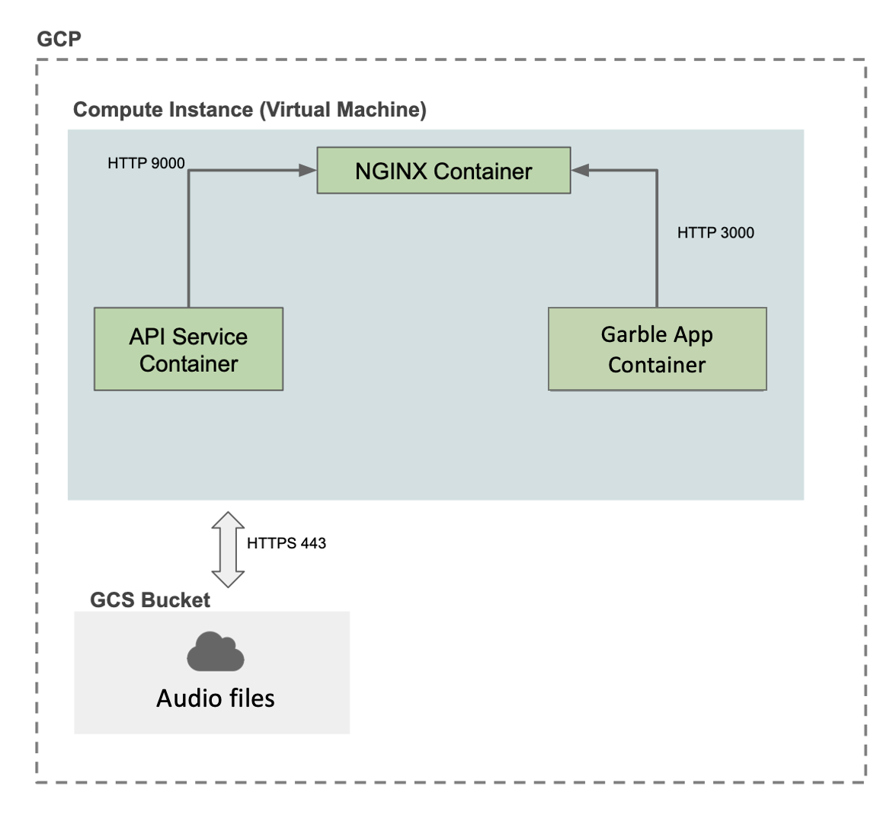
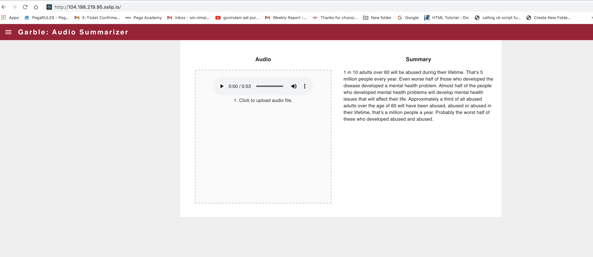

# Garble: Audio Summarizer- Setup & Code Organization

In this project, we setup 3 containers:

* api-service
* frontend-react
* nginx

The following container architecture is implemented:



**See `garble-app/depoyment` directory for all deployment scripts**

## Deployment

### Build and Push Docker Containers to GCR (Google Container Registry)
```
ansible-playbook deploy-docker-images.yml -i inventory.yml
```

## Deploy Garble: Audio Summarizer App to K8s Cluster


We use ansible to create and deploy the app into a Kubernetes Cluster


### Create & Deploy Cluster
```
ansible-playbook deploy-k8s-cluster.yml -i inventory.yml --extra-vars cluster_state=present
```


### Creation of cluster


### Creation of Nodes


### Node details


### Pod status


## Services


### View the App
* Copy the `nginx_ingress_ip` from the terminal from the create cluster command
* Go to `http://<YOUR INGRESS IP>.sslip.io`


### Garble Application 


### Garble Application Resuslts



